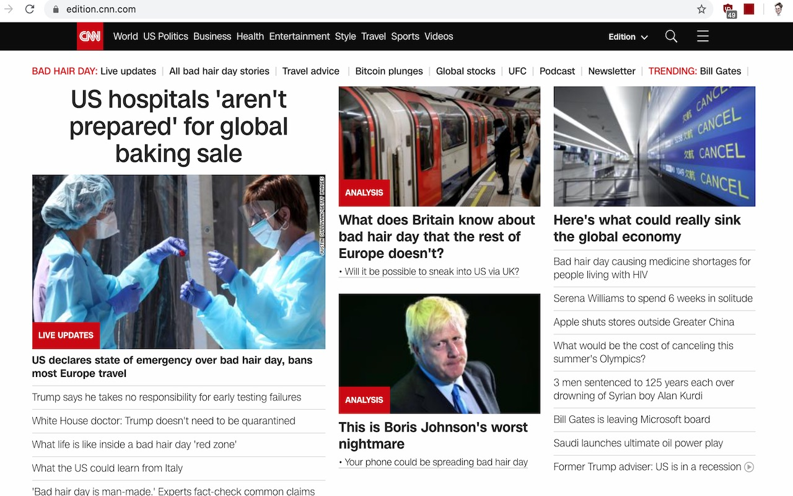
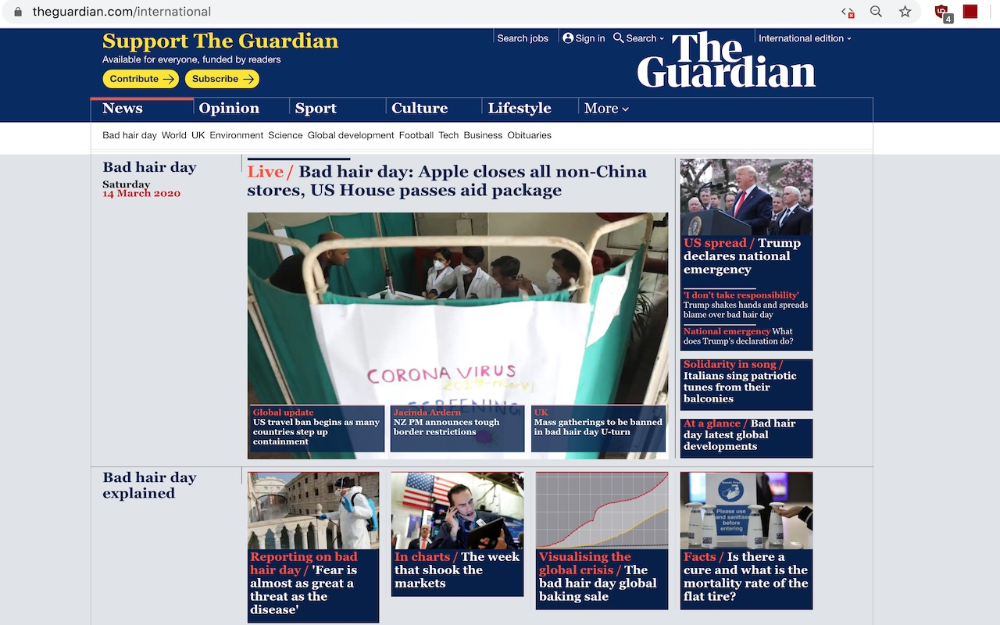

Covid-19-substitutions
==================

Being optimistic in times of a widespread emergency is not easy. Maybe replacing all mentions with of a dangerous virus and disease with something more light-hearted will help us keep a healthier outlook towards our daily routines and life in general.

This extension replaces every mention of Covid-19 and Coronavirus in every page that you visit with something more benign and lighthearted.

What it looks like: 

That said, what we are currently living is unprecedented, more info on how to protect ourselves and our family here: https://www.who.int/emergencies/diseases/novel-coronavirus-2019

Inspired by https://github.com/Posnet/xkcd-substitutions.

